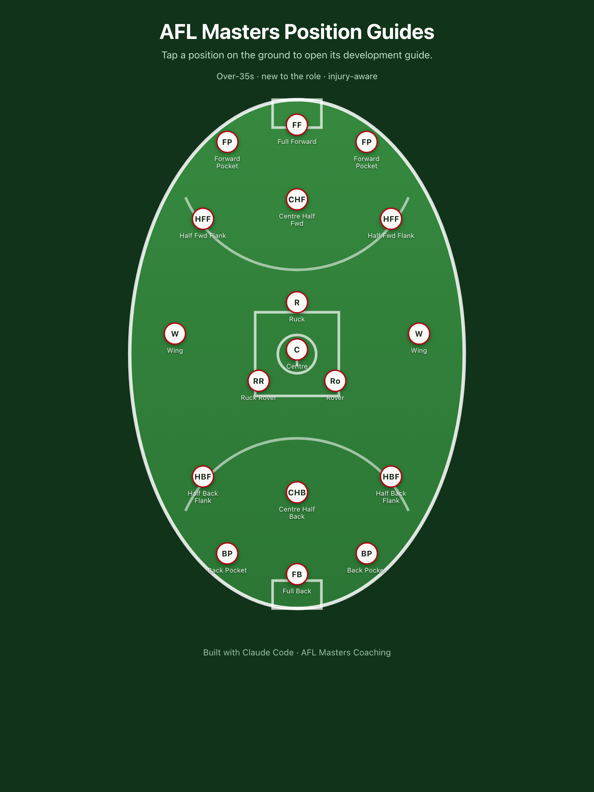

# AFL Masters Position Guides

> An interactive coaching aid that helps over-35s Australian Football players learn a new position. The home screen is a footy oval; tap any position and its full development guide opens in place.

**Live demo:** https://afl-positions.vercel.app &nbsp;·&nbsp; **Backup:** https://neverlastinline.github.io/afl-position-guides/



## About

Players moving into an unfamiliar position rarely have a single, plain-English reference for what the role actually asks of them. This app puts every position on the ground where it lines up, and one tap opens a focused guide written for adult amateurs: what the role is, where to stand, the skills and drills that matter, the mistakes newcomers make, and injury-aware conditioning for an over-35 body.

It is deliberately small and dependency-free — a single HTML file plus a folder of Markdown — so it loads instantly on a phone at training and is trivial to host anywhere.

## Features

- **Interactive ground** — a full AFL oval rendered in SVG (centre square and circle, 50m arcs, goal squares) with 18 clickable position markers placed where players actually set up.
- **Guides on tap** — each marker opens a structured guide: role summary, positioning and movement, core skills and drills, common mistakes, over-35s conditioning, and what good looks like.
- **Content-driven** — every guide is a plain Markdown file. The page loads it at runtime, so the `guides/` files are the single source of truth and there is no duplicated copy to keep in sync.
- **Mobile-first and offline-friendly** — no framework, no build step, no tracking. Just static files.

## How it works

Guides live as Markdown in [`guides/`](guides/). No guide text is hard-coded in the page. When a marker is tapped, the app fetches the matching `guides/<id>.md`, converts it to HTML with a small inline parser, and shows it in a modal. Adding or editing a guide is just editing a `.md` file.

To add a new position:

1. Add `guides/<id>.md`.
2. Add one entry to the `MARKERS` array in `index.html` (id, abbreviation, label, and x/y percentage on the oval).

## Tech

- Single static `index.html`: vanilla HTML, CSS, and JavaScript. No frameworks, no build step, no dependencies.
- Content authored in Markdown and loaded at runtime via `fetch`.
- Deployed as a static site (Vercel for the primary demo, GitHub Pages as a backup).

## Running locally

Because the page fetches Markdown files, it needs to be served over HTTP (opening the file directly will block the fetches). Any static server works:

```bash
python3 -m http.server 4321
# then open http://localhost:4321
```

## Deploying

It is a static site, so it deploys anywhere that serves static files (Vercel, Netlify, GitHub Pages). Both demo links above are the same code served from two hosts.
